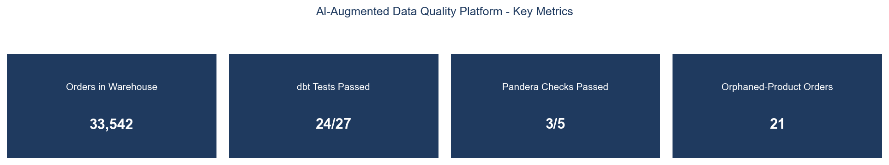
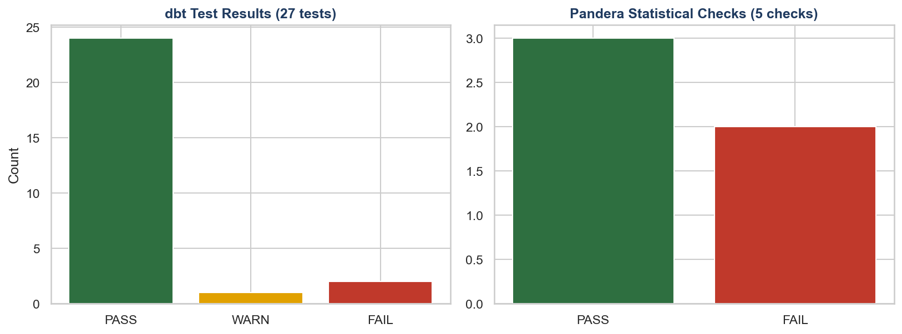
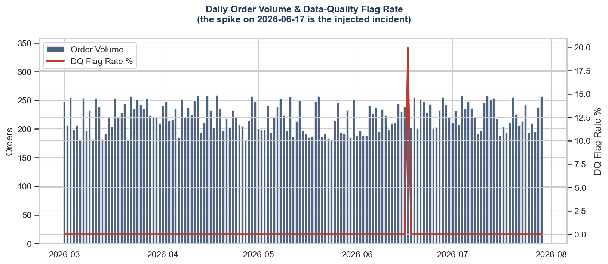

# AI-Augmented Data Quality & Validation Framework

**A project I built to learn analytics engineering and retrieval-augmented generation:** a real dbt + DuckDB transformation pipeline,
a statistical validation layer, and a fully local, citation-backed **AI Data Quality Copilot** —
built to let anyone on a team ask "what's wrong with the data and why?" in plain English, grounded
in real test results, not a hallucinated guess.

> Built by Nikhil Sinha. This project was built specifically to fold GenAI/RAG skills into the
> "traditional" data-engineering track (dbt, data validation) rather than treating them as separate
> tracks, because I wanted to understand how the two fit together rather than studying them separately. Every
> result below is from real, executed pipeline runs — see Section 5 for unedited evidence. All data
> is synthetically generated; see Section 9 for full methodology and tooling honesty notes.

---

## 1. The Business Problem

A raw dbt+tests setup tells a data engineer *that* something failed. It doesn't tell a product
manager, a support agent, or a new analyst *what that means* or *whether they should be worried* —
that usually means pinging the one person who wrote the tests and waiting. This project builds both
halves: a properly layered dbt transformation pipeline with real tests, **and** a local AI copilot
that anyone can ask directly, with every answer grounded in and cited against the actual current
test results — not a model's imagination.

---

## 2. What I Was Trying to Get Right

- **A real, deliberately injected single-day incident** (2026-06-17) that a naive aggregate-rate
  check would completely miss — see Finding #2 in the assessment report, the single most important
  finding in this project.
- **Two validation tools covering genuinely different ground** (dbt = structural/row-level, Pandera
  = statistical/time-aware), not one tool duplicating the other's job.
- **A real, working local RAG pipeline** — not a hosted-API wrapper — built and tuned to actually
  run on a 6GB-RAM machine, including a hallucination guardrail calibrated against real relevant vs.
  irrelevant queries.
- **A second, distinct GenAI use case** (AI-assisted validation-rule drafting) shown honestly,
  including where the tiny local model gets it wrong — which is the actual argument for keeping a
  human in the loop, not just a disclaimer.

---

## 3. Key Results

| Metric | Value |
|---|---|
| Orders in final warehouse (`fct_orders`) | 33,542 |
| dbt tests passed | 24 / 27 (1 warning, 2 real failures — see below) |
| Pandera statistical checks passed | 3 / 5 |
| Incident correctly isolated to a single day | 2026-06-17 (341 orders vs. 222-order average, z=4.56) |
| AI copilot: grounded answers / correct refusals tested | 6 / 6 (see Section 5) |

---

## 4. Dashboard Preview

An interactive Streamlit app (`dashboard/streamlit_app.py`) ships with this project — a Data
Quality Dashboard tab and an AI Copilot Chat tab, both reading live from the same DuckDB warehouse
this pipeline builds. Run it with:

```bash
streamlit run dashboard/streamlit_app.py
```

*(Static chart previews below are rendered directly from the same database — this build
environment has no display to screenshot the live app, but I did verify the live app directly in a
browser during development — see Section 5.)*

**Key metrics**


**dbt test results & Pandera statistical checks**


**The incident, made visible: daily volume vs. data-quality flag rate**


---

## 5. Real Evidence (Not Just Descriptions)

### dbt: real test results, reproduced identically across a full clean rebuild
```
Done. PASS=24 WARN=1 ERROR=2 SKIP=0 NO-OP=0 REUSED=0 TOTAL=27

[ERROR] assert_no_extreme_line_totals: Got 52 results, configured to fail if != 0
[ERROR] relationships_fct_orders_product_id (→ stg_products): Got 21 results, configured to fail if != 0
[WARNING] not_null_stg_orders_customer_id: Got 22 results, configured to warn if >0
```

### Pandera: an independent tool, catching the same incident a different way
```
[FAIL] plausible_value_ranges: 55 value(s) fell outside plausible ranges
[FAIL] daily_volume_anomaly_detection: 2026-06-17 (341 orders, z=4.56) vs. 222-order average
[PASS] missing_customer_rate_threshold: 0.07% — within threshold  ← masks the same incident!
[PASS] orphan_product_rate_threshold: 0.06% — within threshold    ← masks the same incident!
[PASS] email_format_valid
```
(The two PASSes above are the point of Finding #2 in the assessment report — an aggregate rate
threshold alone would have called this dataset healthy. Only the time-aware check caught it.)

### AI Copilot: real, unedited transcripts
Full transcripts (grounded answers, a correct hallucination refusal, and an honest example of the
model drifting slightly off-topic) are in [`docs/copilot_transcript_examples.md`](docs/copilot_transcript_examples.md).
I also drove the chat interface directly in a browser during development and confirmed the same
retrieval → answer → cited-sources flow works end-to-end in the actual Streamlit UI, not just the
CLI.

### Reproducibility: a full clean rebuild produced byte-identical results
Deleted `data/`, `database/`, `reports/`, and the RAG knowledge base, then re-ran
`scripts/run_pipeline.py` end-to-end: identical row counts (33,556 raw orders), identical incident
day, identical dbt test outcome (24/1/2), identical Pandera results (3/5, same z=4.56).

---

## 6. Architecture

Full diagram and design rationale: [`docs/architecture.md`](docs/architecture.md)

```
generate_data.py → load_raw_to_duckdb.py → dbt run → dbt test ─┐
                                              │                  ├─→ build_knowledge_base.py → ChromaDB
                                    pandera_checks.py ───────────┘         │
                                                                            ▼
                                                              copilot.py (retrieve → guardrail → Ollama)
                                                                            │
                                                                            ▼
                                                          Streamlit: Dashboard + AI Copilot Chat
```

---

## 7. Repository Structure

```
05-AI-Augmented-Data-Quality-Validation-Framework/
├── README.md
├── requirements.txt
├── data/                          # generated raw CSVs
├── database/
│   └── warehouse.duckdb            # the actual warehouse dbt builds into
├── dbt_project/
│   ├── dbt_project.yml, profiles.yml
│   ├── models/staging/              # stg_customers, stg_products, stg_orders, stg_payments
│   ├── models/intermediate/          # int_orders_enriched
│   ├── models/marts/                  # fct_orders, dim_customers, dim_products
│   └── tests/                          # 2 custom singular tests
├── validation/
│   └── pandera_checks.py                # 5 statistical/comparative checks
├── rag/
│   ├── build_knowledge_base.py            # embeds test results + docs + runbook into ChromaDB
│   ├── copilot.py                          # retrieval + guardrail + Ollama generation
│   ├── suggest_validation_rules.py          # AI-assisted rule drafting (human-in-the-loop)
│   └── knowledge_base/chroma_store/          # persisted vector store
├── scripts/
│   ├── generate_data.py, load_raw_to_duckdb.py
│   ├── run_pipeline.py                       # one-command orchestrator
│   └── generate_preview_images.py
├── dashboard/
│   └── streamlit_app.py                       # Dashboard + AI Copilot Chat tabs
├── docs/
│   ├── architecture.md
│   └── copilot_transcript_examples.md          # real, unedited AI copilot transcripts
├── reports/
│   ├── data_quality_assessment.md               # the full business-facing findings report
│   ├── pandera_validation_results.json/.md
│   └── ai_suggested_rules/
└── screenshots/
```

---

## 8. How to Run This Yourself

```bash
# 1. Install Ollama and pull the local model (one-time)
winget install Ollama.Ollama
ollama pull qwen2.5:0.5b

# 2. Install Python dependencies
pip install -r requirements.txt

# 3. Run the full pipeline
python scripts/run_pipeline.py

# 4. Launch the dashboard + AI copilot
streamlit run dashboard/streamlit_app.py
```

Ask the copilot things like *"What happened on the incident day?"*, *"Why did the extreme line
totals test fail?"*, or *"Is the payment data trustworthy?"* — or try an off-topic question to see
the hallucination guardrail refuse rather than guess.

---

## 9. Honesty Notes — Data, Tooling, and Hardware Constraints

**Data is synthetic**, generated with a fixed random seed (`scripts/generate_data.py`) so the
pipeline is fully reproducible. One deliberate single-day incident (2026-06-17) is injected —
~355 corrupted rows out of ~33,556 — so the validation layers have a genuine, specific problem to
catch, not clean data pretending otherwise.

**Great Expectations was the originally planned tool** for the statistical validation layer. Its
latest available release in this environment pins `numpy<2.0`, which cannot build from source on
Python 3.14 here (no working C compiler toolchain present). **Pandera** was substituted — a modern,
actively maintained library increasingly used for exactly this purpose in real 2025/2026 data
teams, not a downgrade in rigor. See `validation/pandera_checks.py` for the full technical note.

**The AI copilot's LLM is intentionally tiny (Ollama `qwen2.5:0.5b`, ~400MB).** This project was
built and tested on a machine with only ~6GB total RAM, most of it already committed to background
processes — a genuinely severe constraint, not a stylistic choice. A larger model (3B-8B, or a
hosted API) would produce more fluent, more precisely-scoped answers; the transcripts in
`docs/copilot_transcript_examples.md` show both where this tiny model does well (grounded citation
of real numbers, correct hallucination refusal, appropriately hedged uncertainty) and where it
doesn't (occasionally blending in a tangentially-related retrieved document). This tradeoff, and
the reasoning behind choosing a fully local, zero-cost model over a paid API specifically so this
project can be run by anyone, indefinitely, at no cost, is documented rather than hidden.

**A Windows-specific environment note, for anyone reproducing this on the same kind of setup:**
installing Ollama via `winget` on this machine silently introduced a second, empty Python 3.14
installation (`C:\Python314`) that shadowed the correct, already-populated interpreter earlier in
`PATH`. `scripts/run_pipeline.py` resolves the `dbt` executable relative to `sys.executable` rather
than trusting bare `PATH` lookup specifically to route around this — worth knowing if `pip install`
or `dbt` commands mysteriously report a package as missing that you're sure you already installed.

**What I'd do differently in a real production deployment:** a staged-load-with-atomic-swap pattern
for the marts layer (see `docs/architecture.md`), a larger/hosted LLM for the copilot if budget
allows, and wiring the AI-assisted rule-suggestion feature into a real PR-review workflow (open a
draft PR with suggested `pandera` checks for a human to approve) rather than a standalone markdown
file.

---

## 10. What I Learned Building This

dbt (staging/intermediate/marts modeling, schema + custom singular tests) · DuckDB · Data
Validation & Data Reconciliation · Statistical/Anomaly Detection (Pandera, z-score analysis) ·
**Retrieval-Augmented Generation (RAG)** · Vector Databases (ChromaDB) · Local LLM Deployment
(Ollama) · Prompt Engineering · Hallucination Guardrails · AI-Assisted Tooling (human-in-the-loop
design) · SQL · Python · Dashboard Design (Streamlit) · Technical Writing / Root-Cause Analysis
