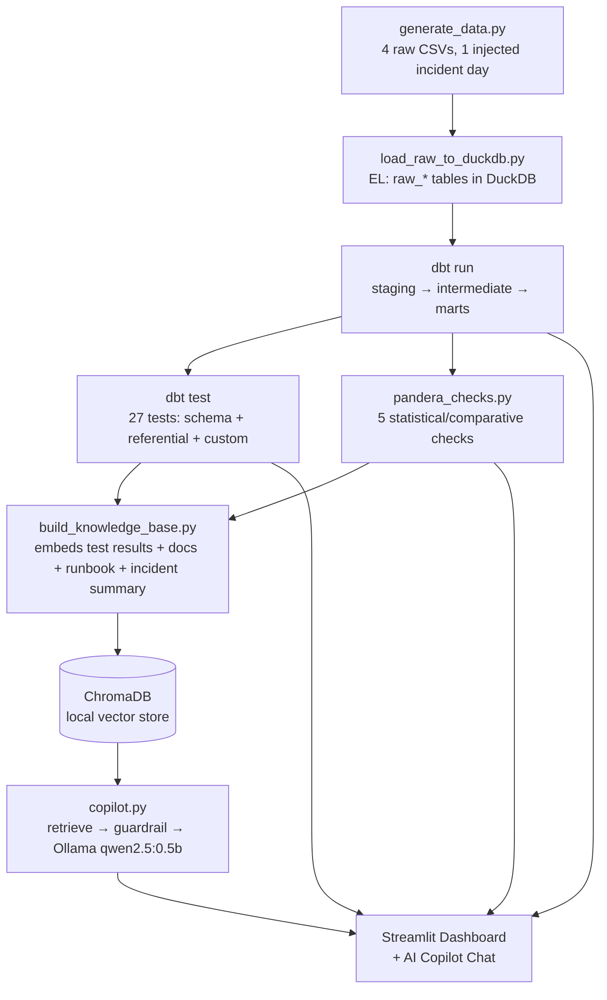

# Architecture

## Pipeline flow

## Why dbt run + dbt test, not dbt build

`dbt build` (models + tests interleaved) is the more common convenience command, and it produced a
correct, protective result in early testing here: when the price-bug singular test failed, `dbt
build` correctly refused to build `fct_orders`, `dim_customers`, and `dim_products` on top of it,
because they depend on the model the failing test covers. That is genuinely the right behavior for
a production **circuit-breaker** pattern.

This project instead runs `dbt run` and `dbt test` as two **separate** steps, which is also a
real, common production pattern (BI/reporting availability shouldn't halt just because a monitoring
test fired) - and, pragmatically, it means the marts always exist for the dashboard and AI copilot
to explore. The tradeoff is real and disclosed, not hidden: a corrupted batch's rows **do** land in
`fct_orders` before `dbt test` ever runs, since `run` and `test` aren't wrapped in one transaction
across separate CLI invocations.

**What I'd do differently in a real production deployment:** load into a dated staging table first
(`fct_orders__staging_2026_06_17`), run the quality checks against the staging table, and only have
a final step atomically swap it into the production `fct_orders` table if the checks pass - a
classic blue-green load pattern that gets the best of both: warehouse availability during normal
operation, and a genuine circuit-breaker against a batch actively corrupting the trusted table.

## Two validation tools, deliberately covering different ground

| | dbt tests | Pandera checks |
|---|---|---|
| **Answers** | "Is this ever null/duplicated?" "Does this foreign key always resolve?" | "Is this value plausible?" "Does today look statistically normal vs. recent history?" |
| **Granularity** | Row-level, deterministic | Row-level (ranges) AND time-aware/comparative (z-scores, rates) |
| **Caught in this project** | 21 orphaned products, 52 extreme prices, 22 missing customers | The SAME issues independently (55 out-of-range values), PLUS the daily-volume anomaly that no single-row dbt test could express |

The most important finding in this project (`reports/data_quality_assessment.md` Finding #2) only
exists because both tools were run: dbt's individual-row tests never look across days, and Pandera's
own aggregate-rate checks (missing-customer rate, orphan-product rate) both *passed* because the
incident's ~22 bad rows are a tiny fraction of 33,556 total orders. Only the **time-aware** Pandera
check (daily order-volume z-score) caught the day itself.

## AI Copilot: retrieval and guardrail design

- **Embeddings:** ChromaDB's built-in ONNX MiniLM embedding function (`all-MiniLM-L6-v2`, ~80MB,
  runs via `onnxruntime`). Deliberately chosen over `sentence-transformers`/`torch` (which this
  project also has installed) to avoid loading the much heavier torch runtime on a 6GB-RAM machine -
  a real, hardware-driven engineering tradeoff, not a default.
- **Vector store:** ChromaDB, persisted locally to disk (`rag/knowledge_base/chroma_store/`) - no
  server, no external service.
- **Generation model:** Ollama `qwen2.5:0.5b` (~400MB). Chosen specifically for its small memory
  footprint - see README Section 9 for the full hardware-constraint story and what a larger model
  would likely do better.
- **Hallucination guardrail:** before generating anything, the retrieval step's best-match distance
  is checked against a threshold (1.4), calibrated empirically:
  - Relevant queries (e.g., "why did the extreme line totals test fail?") scored 0.85-1.26.
  - An irrelevant query ("What is the capital of France?") scored 1.88.
  If nothing relevant enough is found, the copilot returns a fixed refusal message instead of
  calling the LLM at all - see `docs/copilot_transcript_examples.md` example #2 for the real,
  captured output of this behavior.
- **Every answer returns its sources.** The UI always shows which retrieved documents (and their
  distance scores) the answer was built from, so a user can verify the claim rather than just
  trust it.

## Data model

`fct_orders` carries explicit data-quality flag columns (`is_orphan_product`,
`is_missing_customer`, `is_invalid_quantity`, `amount_mismatch`) computed once, upstream, in the
dbt layers - rather than every downstream consumer (the dashboard, the copilot's knowledge base
builder, an analyst's ad-hoc query) needing to re-derive "is this row suspicious" logic
independently and risk drifting out of sync with each other.
